# DevDuck agents

A multi-agent system for Go programming assistance built with Google Agent Development Kit (ADK). This project features a coordinating agent (DevDuck) that manages two specialized sub-agents (Bob and Cerebras) for different programming tasks.

```mermaid
graph TB
    DC[🐙 Docker Compose<br/>Orchestration Layer]
    
    subgraph "Multi-Agent System"
        DD[🦆 DevDuck<br/>Main Coordinator<br/>Qwen3 4B]
        BOB[👨‍💻 Bob Agent<br/>Go Development<br/>Qwen2.5]
        CER[🧠 Cerebras Agent<br/>Complex Problem Solving<br/>Llama-4 Scout]
    end
    
    USER[👤 User]
    
    DC --> DD
    DC --> BOB
    DC --> CER
    
    USER --> DD
    
    DD -->|Routes general requests| BOB
    DD -->|Routes complex tasks| CER
    
    BOB -.->|Can route back| DD
    CER -.->|Can route back| DD
    
    classDef orchestrator fill:#e1f5fe
    classDef agent fill:#f3e5f5
    classDef interface fill:#e8f5e8
    classDef user fill:#fff3e0
    
    class DC orchestrator
    class DD,BOB,CER agent
    class USER user
```




## Architecture

The system consists of three main agents orchestrated by Docker Compose, which plays a **primordial role** in launching and coordinating all agent services:

### 🐙 Docker Compose Orchestration
- **Central Role**: Docker Compose serves as the foundation for the entire multi-agent system
- **Service Orchestration**: Manages the lifecycle of all three agents (DevDuck, Bob, and Cerebras)
- **Configuration Management**: Defines agent prompts, model configurations, and service dependencies directly in the compose file
- **Network Coordination**: Establishes secure inter-agent communication channels
- **Environment Management**: Handles API keys, model parameters, and runtime configurations

### Agent Components:

### 🦆 DevDuck (Main Agent)
- **Role**: Main development assistant and project coordinator
- **Model**: Qwen3 (unsloth/qwen3-gguf:4B-UD-Q4_K_XL)
- **Capabilities**: Routes requests to appropriate sub-agents based on user needs

### 👨‍💻 Bob Agent
- **Role**: General development tasks and project coordination
- **Model**: Qwen2.5 (ai/qwen2.5:latest)
- **Specialization**: Go programming expert for understanding code, explaining concepts, and generating code snippets

### 🧠 Cerebras Agent
- **Role**: Advanced computational tasks and complex problem-solving
- **Model**: Llama-4 Scout (llama-4-scout-17b-16e-instruct)
- **Provider**: Cerebras API
- **Specialization**: Go programming expert for complex problem-solving scenarios

## Features

- **Multi-agent coordination**: Routing between specialized agents
- **Go programming expertise**: All agents specialize in Go/Golang development
- **FastAPI web interface**: RESTful API with web interface support
- **Docker containerization**: Easy deployment with Docker Compose
- **Flexible model configuration**: Support for multiple LLM providers (local and cloud)

## Quick Start

### Prerequisites

- Docker and Docker Compose
- Cerebras API key (for Cerebras agent)

### Configuration

1. **You need a Cerebras API Key**: https://cloud.cerebras.ai/
2. Create a `.env` file with the following content:

```env
CEREBRAS_API_KEY=<your_cerebras_api_key>
CEREBRAS_BASE_URL=https://api.cerebras.ai/v1
CEREBRAS_CHAT_MODEL=llama-4-scout-17b-16e-instruct
```
> look at the `.env.sample` file

### ✋ All the prompts are defined in the 🐙 compose file

### Start the services

```bash
docker compose up
# if you updated the code, use --build
```

The application will be available at [http://0.0.0.0:8000](http://0.0.0.0:8000)


### Usage

The agents can be accessed through the web interface or API endpoints.

> Activate Token Streaming

**You can try this**:
```text
Hello I'm Phil

Bob generate a gloang hello world program

Add a human struct with a hello method

Cerebras can you analyse and comment this code

Can you generate the tests
```
> ✋ For a public demo, stay simple, the above examples are working.

**🎥 How to use the demo**: [https://youtu.be/WYB31bzfXnM](https://youtu.be/WYB31bzfXnM)

#### Routing Requests

- **General requests**: Handled by DevDuck, who routes to appropriate sub-agents
- **Specific agent requests**: 
  - "I want to speak with Bob" → Routes to Bob agent
  - "I want to speak with Cerebras" → Routes to Cerebras agent

## Tips

If for any reason, you cannot go back from the Cerebras agent to the Bob agent, try this:
```text
go back to devduck
```
